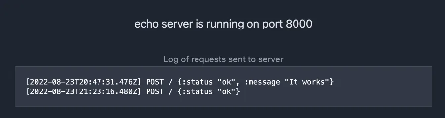

# Node Babashka ClojureScript Fetch Example



A ClojureScript example of using native the native node fetch API introduced in
node 18+ powered by [nbb](https://github.com/babashka/nbb).

For both fun and completeness this example also runs an echo server in express
and logs requests to the client through websockets.

The frontend UI uses [scittle](https://github.com/babashka/scittle) to run a
clientside script that connects to the webserver and appends to the UI. No
bundling required!

## Usage

1. Clone the repo
2. In a terminal, enter the repo `cd nbb-fetch-ws-example`
3. Install dependencies `yarn install`
4. Run the shell repl `yarn start`
5. Visit the page at `http://localhost:8000`

### Run an nrepl-server instead

If you prefer to run an nrepl-server run `yarn repl` and connect to it from your editor.

## See it on Repl It

https://replit.com/@eccentric-j/Node-Babashka-Fetch-Example#src/cli/core.cljs

See a live demo with an interactive cljs nbb repl.

### Using the REPL

If using the shell repl or exploring in replit, you may use the simplified fetch
function to test sending a request.

It works identically to the native fetch function but only takes a body object
that accepts valid serializable, ClojureScript data types.

```clojure
(fetch {:timestamp (js/Date.now)})
```

When working, you should be able to paste that in the repl and see the response echoed
and the clientside logs the server request.


#### Use node's fetch function

Of course you may be looking for how to use the native node fetch function. Just
use it like any function:


``` clojure
(p/-> (js/fetch "http://localhost:8000"
                #js {:method "POST"
                     :body (js/JSON.stringify
                            #js {:status "OK"})})
      (.json)
      (js/console.log)
      (p/catch js/console.error))
```

The promise handling in that example is making use of the
[promesa](https://cljdoc.org/d/funcool/promesa/8.0.450/api/promesa.core) promise
library included in nbb. Regular JS syntax will work too.
